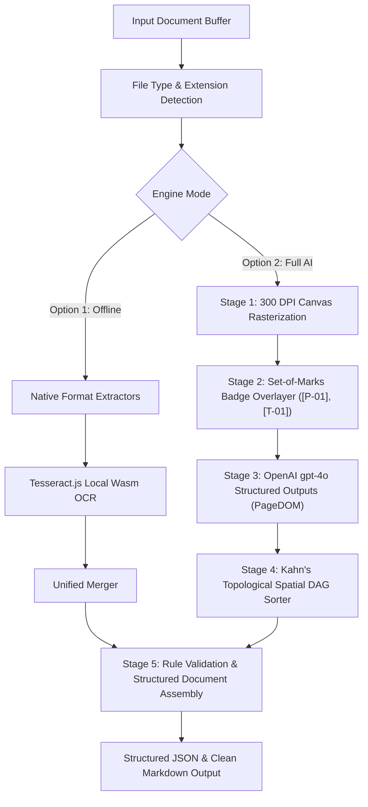

# Document Intelligence Engine 🚀

> **High-Precision, Standalone Document Extraction & Vision OCR Engine for Node.js & TypeScript.**  
> Built to operate 100% natively without Python dependencies.

[](https://document-engine-nu.vercel.app/)
[](https://www.typescriptlang.org/)
[](LICENSE)

---

## 📌 Overview

**Document Intelligence Engine** is a reusable, production-grade document extraction, layout parsing, and multimodal vision library. It is designed to be imported as a **standalone NPM / Node.js module** across any server, CLI tool, or web service.

The repository includes a web app interface deployed live at **[https://document-engine-nu.vercel.app/](https://document-engine-nu.vercel.app/)**, designed for visual testing, real-time bounding box inspection, and user convenience.

---

## ✨ Key Features

- ⚡ **100% Native Node.js & TypeScript**: Zero Python dependencies or lock-ins. Runs seamlessly on Vercel, AWS Lambda, Docker, or bare-metal servers.
- 🔀 **Dual Execution Pipelines**:
  - **Option 1: Pure Offline Engine (`engineMode: "offline"`)**: 100% local layout extraction using PDF.js, Mammoth OpenXML, ADM-Zip, and local Wasm Tesseract.js OCR. **Zero LLM or API costs.**
  - **Option 2: Full AI Vision Engine (`engineMode: "ai"`)**: Hybrid 5-Stage Set-of-Marks (SoM) visual badge tagging at 300 DPI + Kahn's Topological Spatial DAG Sorter + OpenAI `gpt-4o` Structured Outputs (`PageDOM`).
- 📁 **Universal File Format Support**:
  - **PDF Documents** (`.pdf`) — Scanned, native, or hybrid multipage PDFs.
  - **Word Documents** (`.docx`, `.doc`) — Preserves headings, tables, code blocks, lists, and inline styles.
  - **PowerPoint Presentations** (`.pptx`, `.ppt`) — Preserves slide layouts, text frames, and table grids.
  - **Excel & CSV Spreadsheets** (`.xlsx`, `.xls`, `.csv`, `.tsv`) — Formatted into clean Markdown tables.
  - **Standalone Images** (`.png`, `.jpg`, `.jpeg`, `.webp`, `.bmp`) — Automatic OCR routing.
  - **Source Code & Text** (`.py`, `.ts`, `.js`, `.json`, `.md`, `.txt`) — Binary-safe plain text extraction.
- 📐 **Spatial DAG Reading Order**: Kahn's Topological Sorting algorithm resolves reading order for multi-column academic papers, financial sidebars, and slide decks.
- 📊 **Structured Output Schema**: Outputs normalized JSON containing `pages`, `blocks`, `tables`, `outline`, `processingStats`, and rule-based `validationReport`.

---

## 🌐 Live Web Application

Try out the engine live in your browser:  
👉 **[https://document-engine-nu.vercel.app/](https://document-engine-nu.vercel.app/)**

The Web Application features:
- **Left Document Viewer**: High-DPI canvas preview with zoom controls (`+`, `-`, reset) and interactive color-coded bounding box overlays.
- **Right Block Inspector**: Tabbed views for *Markdown Output*, *Extracted Blocks*, *Validation Report*, *Execution Stats*, and *Live Server Console Logs*.
- **API Key Modal**: Prompts users for an OpenAI API key only when running Option 2 without a server-side key configured.
- **Mobile Responsive**: Fully optimized for mobile phone, tablet, and desktop screens.

---

## 🛠️ Usage as a Standalone Library

You can import `processDocument` directly into your Node.js or Express backend:

### Installation
```bash
npm install doc-intel-engine
```

### Basic Example (Node.js / TypeScript)

```typescript
import { processDocument, exportToMarkdown } from "doc-intel-engine";
import * as fs from "fs";

async function main() {
  const fileBuffer = fs.readFileSync("./sample_presentation.pdf");

  // 1. Process Document under Option 1 (Offline Engine)
  const result = await processDocument(fileBuffer, {
    engineMode: "offline",
    originalFilename: "sample_presentation.pdf",
  });

  console.log(`Extracted ${result.pages.length} pages and ${result.tables.length} tables.`);

  // 2. Export to Markdown
  const markdown = exportToMarkdown(result);
  fs.writeFileSync("./output.md", markdown);
}

main();
```

### Option 2 (Full AI Vision Pipeline)

```typescript
const result = await processDocument(fileBuffer, {
  engineMode: "ai",
  apiKey: process.env.OPENAI_API_KEY,
  model: "gpt-4o",
  maxDpi: 300,
});
```

---

## 🏗️ Architecture & 5-Stage Multimodal Vision Pipeline



---

## 🚀 Running Locally

To run the standalone server and interactive web app on your machine:

```bash
# 1. Clone repository
git clone https://github.com/HassanCpp/Document-engine.git
cd Document-engine

# 2. Install dependencies
npm install

# 3. Create .env file (optional for OpenAI Vision)
echo "OPENAI_API_KEY=your_key_here" > .env

# 4. Start local development server
npm run dev
```

Open **[http://localhost:3001](http://localhost:3001)** in your browser.

---

## ☁️ Vercel Serverless Deployment

This repository is pre-configured with `vercel.json` and `/api/index.ts` for Vercel Serverless Functions deployment.

```bash
# Deploy to Vercel via CLI
npx vercel --prod
```

---

## 📄 License

Distributed under the **MIT License**. See `LICENSE` for details.
